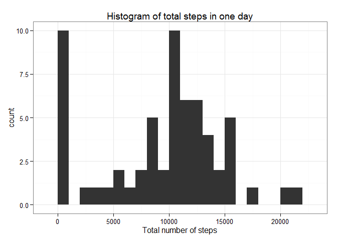
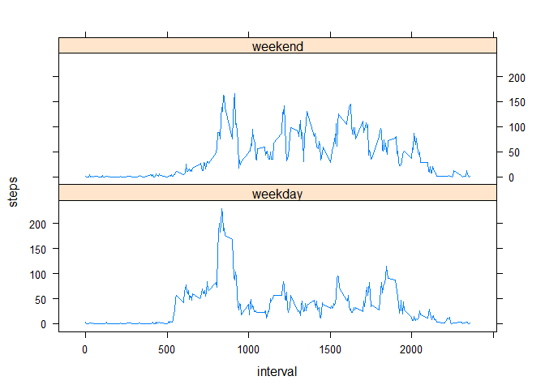

# Reproducible Research: Peer Assessment 1
Vasudha Upadhyaya  


## Loading and preprocessing the data
Header code, setup required libraries


```r
library(ggplot2)
library(plyr)
library(lattice)
```

Loading and preprocessing the data

```r
#read in

unzip(zipfile="activity.zip")
activity<-read.csv("activity.csv",colClasses=c("integer","Date","integer"))


stepstakenperday<-ddply(activity, c("date"),summarise,
                   totalsteps=sum(steps,na.rm=TRUE)
                   )

stepstakenper5min<-ddply(activity, c("interval"),summarise,
                    meansteps = mean(steps,na.rm=TRUE)
                    )
```

## What is mean total number of steps taken per day?

Below is the histogram of the total number of steps taken each day


```r
meansteps <- mean(stepstakenperday$totalsteps, na.rm=TRUE)

mediansteps <- median(stepstakenperday$totalsteps)


stepshist<-ggplot(stepstakenperday,aes(x=totalsteps))+geom_histogram(binwidth=1000)+
  xlab("Total number of steps")+
  ggtitle("Histogram of total steps in one day")+
  theme_bw()
print(stepshist)
```

 


The median total number of steps taken per day is 9354.2295

The mean total number of steps taken per day is 10395


## What is the average daily activity pattern?


The average daily activity pattern is 


```r
dayline<-ggplot(stepstakenper5min,aes(x=interval,y=meansteps))+geom_line()+
  ggtitle("Average steps for each 5-min interval")+
  ylab("Mean steps")+
  theme_bw()
print(dayline)
```

 

```r
meanstepcount<- stepstakenper5min[which(stepstakenper5min$meansteps==max(stepstakenper5min$meansteps)), "interval"]
meanstepcount5min<- stepstakenper5min[which(stepstakenper5min$meansteps==max(stepstakenper5min$meansteps)), "meansteps"]
```

The five minute interval with the highest mean step-count is interval 835 with a mean of 206.1698 steps.


## Imputing missing values

Note that there are a number of days/intervals where there are missing values (coded as NA). The presence of missing days may introduce bias into some calculations or summaries of the data.

Calculate and report the total number of missing values in the dataset (i.e. the total number of rows with NAs)


```r
x<-(is.na(activity$steps))
navaluesnum<-sum(x)
```
There are 2304 NA values in the dataset.

Devise a strategy for filling in all of the missing values in the dataset. The strategy does not need to be sophisticated. For example, you could use the mean/median for that day, or the mean for that 5-minute interval, etc.

I used the startegy to input the 5-minute interval mean.

Create a new dataset that is equal to the original dataset but with the missing data filled in.


```r
activity2<-activity[complete.cases(activity),]

activity2$time<-strptime((sapply(activity2$interval, formatC, width = 4, flag = 0)), format = "%H%M")
activity2$time <- format(activity2$time,"%H:%M")

actsum2<-ddply(activity2, "date", summarize, 
              steps=sum(steps),
              interval=sum(interval),
              time=max(time))

intervalsum2<-ddply(activity2, "time", summarize, 
              date=mode(date),
              steps=mean(steps),
              interval=max(interval))

stepmeans<-ddply(activity2,~interval,summarise,mean=mean(steps))
interval<-stepmeans$interval
datafield<-activity

for (i in 1:length(datafield[, 1])){
    if (is.na(datafield[i,1]))
        {datafield[i,1]<-stepmeans[which(interval==datafield[i,3]), 2]}
    else if (is.na(datafield[i,1])==FALSE)
      {datafield[i,1]<-datafield[i,1]}

}
```

Make a histogram of the total number of steps taken each day and Calculate and report the mean and median total number of steps taken per day.


```r
datafield$time<-strptime((sapply(datafield$interval, formatC, width = 4, flag = 0)), format = "%H%M")
datafield$time <- format(datafield$time,"%H:%M")

datafieldsum2<-ddply(datafield, "date", summarize, 
              steps=sum(steps),
              interval=sum(interval),
              time=max(time))

qplot(steps, data=datafieldsum2, main='Histogram Using Imputed Values', binwidth=1000)
```

 

```r
oldmean<-mean(actsum2$steps)
oldmedian<-median(actsum2$steps)

impmean<-mean(datafieldsum2$steps)
impmedian<-median(datafieldsum2$steps)
```
The new mean is 1.0766 &times; 10<sup>4</sup>.
The old mean is 1.0766 &times; 10<sup>4</sup>. 

The new median is 1.0766 &times; 10<sup>4</sup>, 
The old median is 10765.

Do these values differ from the estimates from the first part of the assignment? What is the impact of imputing missing data on the estimates of the total daily number of steps?

The mean values are the same. The median values have a very little difference . 

Due to the imputing of missing values, median value is impacted with a a little difference, however there is no change to the mean 

The histogram is more centralizied, with more values landing on the average.


## Are there differences in activity patterns between weekdays and weekends?

For this part the weekdays() function may be of some help here. Use the dataset with the filled-in missing values for this part.

Create a new factor variable in the dataset with two levels - "weekday" and "weekend" indicating whether a given date is a weekday or weekend day.


```r
for (i in 1:length(datafield[, 2])){
    if (weekdays(datafield[i, 2])=="Saturday")
        {datafield$weekend[i]<-'weekend'}
    else if ((weekdays(datafield[i, 2])=="Sunday"))
        {datafield$weekend[i]<-'weekend'}
    else {datafield$weekend[i]<-'weekday'}
}

 datafieldweekend<-ddply(datafield,~time*weekend,summarise,
                  date=mode(date),
                  steps=format(mean(steps), scientific = NA),
                  interval=max(interval),
                  time=max(time))
```

Make a panel plot containing a time series plot (i.e. type = "l") of the 5-minute interval (x-axis) and the average number of steps taken, averaged across all weekday days or weekend days (y-axis). The plot should look something like the following, which was creating using simulated data:


```r
datafieldweekend <- transform(datafieldweekend, weekend = factor(weekend))
x<-datafieldweekend$interval
y<-datafieldweekend$steps
z<-datafieldweekend$weekend
datafieldweekend$steps<-as.numeric(datafieldweekend$steps)

xyplot(steps~interval|weekend, data=datafieldweekend, type='l', layout=c(1, 2))
```

 
